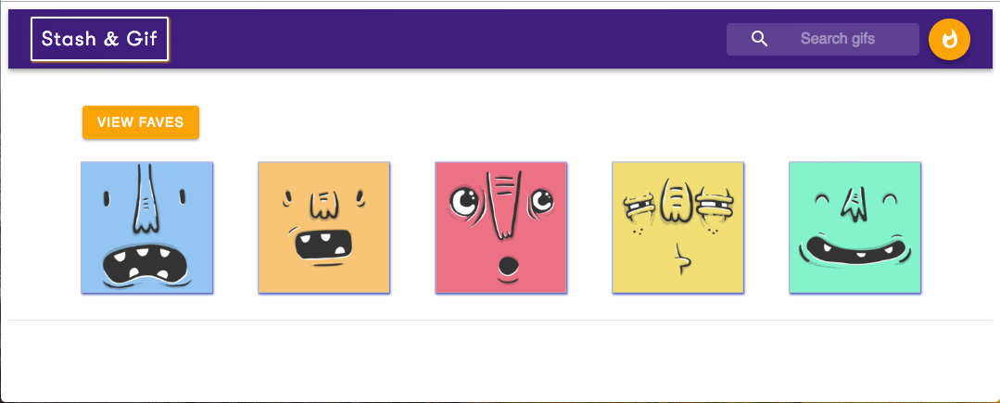

# Stash & Gif




## Start

Install using npm as follows:
``` 
npm i  
```

And to start the server: 
```
npm run start

```

## Live

https://competent-morse-8ec57b.netlify.com/


### Features & Features 2 Be
* Lazy Loading Gifs - Infinite Scroll
* Drag & Drop your Favorite Gifs
* Animations - Done
* Fixed Header Favorites List -Done
* Favorites Carousel
* Persist favorite gifs using local storage - Done
* Error handling - Done
* Responsive Design


### Stack
* Client Framework: React & Redux - Complete
* Type checking with Flow - Incomplete
* Unit Testing w/ Jest, Enzyme - Incomplete
* DotEnv for storing credentials - Complete
* Styled using Custom CSS & Materiual-UI - Complete
* Git for version control - Complete
* Redux Thunk to manage async dispatches - Complete
* Axios for network requests - Complete
* Served from Heroku - Complete
* NPM - Complete


